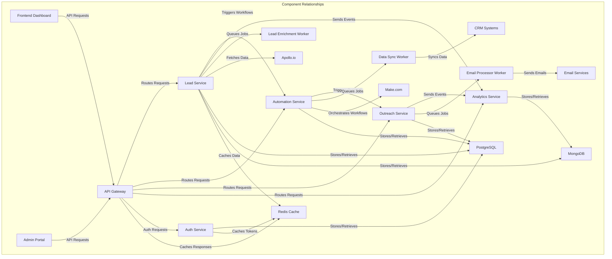

```mermaid
graph TD
    subgraph "Component Relationships"
        %% Frontend Components
        Dashboard["Frontend Dashboard"]
        Admin["Admin Portal"]
        
        %% Backend Services
        ApiGateway["API Gateway"]
        LeadService["Lead Service"]
        AutomationService["Automation Service"]
        OutreachService["Outreach Service"]
        AnalyticsService["Analytics Service"]
        AuthService["Auth Service"]
        
        %% Workers
        LeadEnrichment["Lead Enrichment Worker"]
        DataSync["Data Sync Worker"]
        EmailProcessor["Email Processor Worker"]
        
        %% External Services
        Apollo["Apollo.io"]
        Make["Make.com"]
        CRM["CRM Systems"]
        Email["Email Services"]
        
        %% Data Stores
        PostgreSQL["PostgreSQL"]
        MongoDB["MongoDB"]
        Redis["Redis Cache"]
        
        %% Frontend to Backend
        Dashboard -->|API Requests| ApiGateway
        Admin -->|API Requests| ApiGateway
        
        %% API Gateway to Services
        ApiGateway -->|Routes Requests| LeadService
        ApiGateway -->|Routes Requests| AutomationService
        ApiGateway -->|Routes Requests| OutreachService
        ApiGateway -->|Routes Requests| AnalyticsService
        ApiGateway -->|Auth Requests| AuthService
        
        %% Service Interactions
        LeadService -->|Triggers Workflows| AutomationService
        AutomationService -->|Triggers Outreach| OutreachService
        LeadService -->|Sends Events| AnalyticsService
        OutreachService -->|Sends Events| AnalyticsService
        
        %% Service to Workers
        LeadService -->|Queues Jobs| LeadEnrichment
        AutomationService -->|Queues Jobs| DataSync
        OutreachService -->|Queues Jobs| EmailProcessor
        
        %% External Integrations
        LeadService -->|Fetches Data| Apollo
        AutomationService -->|Orchestrates Workflows| Make
        DataSync -->|Syncs Data| CRM
        EmailProcessor -->|Sends Emails| Email
        
        %% Data Access
        LeadService -->|Stores/Retrieves| PostgreSQL
        LeadService -->|Stores/Retrieves| MongoDB
        AutomationService -->|Stores/Retrieves| PostgreSQL
        OutreachService -->|Stores/Retrieves| PostgreSQL
        AnalyticsService -->|Stores/Retrieves| MongoDB
        AuthService -->|Stores/Retrieves| PostgreSQL
        
        %% Caching
        LeadService -->|Caches Data| Redis
        ApiGateway -->|Caches Responses| Redis
        AuthService -->|Caches Tokens| Redis
    end
```
