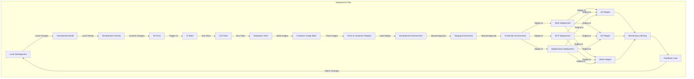

```mermaid
graph TD
    subgraph "Deployment Flow"
        %% Development Phase
        Dev["Local Development"]
        DevBuild["Development Build"]
        DevTest["Development Testing"]
        
        %% CI/CD Pipeline
        GitPush["Git Push"]
        CIBuild["CI Build"]
        UnitTests["Unit Tests"]
        IntegrationTests["Integration Tests"]
        ImageBuild["Container Image Build"]
        ImagePush["Push to Container Registry"]
        
        %% Deployment Environments
        DevDeploy["Development Environment"]
        StagingDeploy["Staging Environment"]
        ProdDeploy["Production Environment"]
        
        %% Multi-Cloud Deployment
        AWS["AWS Deployment"]
        GCP["GCP Deployment"]
        DO["DigitalOcean Deployment"]
        
        %% Global Deployment
        USRegion["US Region"]
        EURegion["EU Region"]
        APACRegion["APAC Region"]
        
        %% Monitoring and Feedback
        Monitoring["Monitoring & Alerting"]
        Feedback["Feedback Loop"]
        
        %% Flow: Development
        Dev -->|Local Changes| DevBuild
        DevBuild -->|Local Testing| DevTest
        DevTest -->|Commit Changes| GitPush
        
        %% Flow: CI/CD Pipeline
        GitPush -->|Trigger CI| CIBuild
        CIBuild -->|Run Tests| UnitTests
        UnitTests -->|Run Tests| IntegrationTests
        IntegrationTests -->|Build Images| ImageBuild
        ImageBuild -->|Push Images| ImagePush
        
        %% Flow: Environment Deployment
        ImagePush -->|Auto Deploy| DevDeploy
        DevDeploy -->|Manual Approval| StagingDeploy
        StagingDeploy -->|Manual Approval| ProdDeploy
        
        %% Flow: Multi-Cloud
        ProdDeploy -->|Deploy to| AWS
        ProdDeploy -->|Deploy to| GCP
        ProdDeploy -->|Deploy to| DO
        
        %% Flow: Global Regions
        AWS -->|Deploy to| USRegion
        AWS -->|Deploy to| EURegion
        AWS -->|Deploy to| APACRegion
        
        GCP -->|Deploy to| USRegion
        GCP -->|Deploy to| EURegion
        GCP -->|Deploy to| APACRegion
        
        DO -->|Deploy to| USRegion
        DO -->|Deploy to| EURegion
        DO -->|Deploy to| APACRegion
        
        %% Flow: Monitoring and Feedback
        USRegion --> Monitoring
        EURegion --> Monitoring
        APACRegion --> Monitoring
        
        Monitoring --> Feedback
        Feedback -->|Inform Changes| Dev
    end
```
