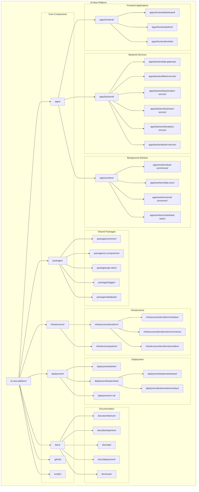

```mermaid
graph TD
    subgraph "AI-Now Platform"
        Root["ai-now-platform/"]
        
        subgraph "Core Components"
            Apps["apps/"]
            Packages["packages/"]
            Infra["infrastructure/"]
            Deploy["deployment/"]
            Docs["docs/"]
            GitHub[".github/"]
            Scripts["scripts/"]
        end
        
        subgraph "Frontend Applications"
            Frontend["apps/frontend/"]
            Dashboard["apps/frontend/dashboard/"]
            Admin["apps/frontend/admin/"]
            Mobile["apps/frontend/mobile/"]
        end
        
        subgraph "Backend Services"
            Backend["apps/backend/"]
            ApiGateway["apps/backend/api-gateway/"]
            LeadService["apps/backend/lead-service/"]
            AutomationService["apps/backend/automation-service/"]
            OutreachService["apps/backend/outreach-service/"]
            AnalyticsService["apps/backend/analytics-service/"]
            AuthService["apps/backend/auth-service/"]
        end
        
        subgraph "Background Workers"
            Workers["apps/workers/"]
            LeadEnrichment["apps/workers/lead-enrichment/"]
            DataSync["apps/workers/data-sync/"]
            EmailProcessor["apps/workers/email-processor/"]
            ScheduledTasks["apps/workers/scheduled-tasks/"]
        end
        
        subgraph "Shared Packages"
            Common["packages/common/"]
            UIComponents["packages/ui-components/"]
            ApiClient["packages/api-client/"]
            Logger["packages/logger/"]
            Database["packages/database/"]
        end
        
        subgraph "Infrastructure"
            Terraform["infrastructure/terraform/"]
            TerraformModules["infrastructure/terraform/modules/"]
            TerraformEnvs["infrastructure/terraform/environments/"]
            TerraformProviders["infrastructure/terraform/providers/"]
            Pulumi["infrastructure/pulumi/"]
        end
        
        subgraph "Deployment"
            Docker["deployment/docker/"]
            Kubernetes["deployment/kubernetes/"]
            KubernetesBase["deployment/kubernetes/base/"]
            KubernetesOverlays["deployment/kubernetes/overlays/"]
            CICD["deployment/ci-cd/"]
        end
        
        subgraph "Documentation"
            Architecture["docs/architecture/"]
            Development["docs/development/"]
            API["docs/api/"]
            DeploymentDocs["docs/deployment/"]
            User["docs/user/"]
        end
        
        Root --> Apps
        Root --> Packages
        Root --> Infra
        Root --> Deploy
        Root --> Docs
        Root --> GitHub
        Root --> Scripts
        
        Apps --> Frontend
        Apps --> Backend
        Apps --> Workers
        
        Frontend --> Dashboard
        Frontend --> Admin
        Frontend --> Mobile
        
        Backend --> ApiGateway
        Backend --> LeadService
        Backend --> AutomationService
        Backend --> OutreachService
        Backend --> AnalyticsService
        Backend --> AuthService
        
        Workers --> LeadEnrichment
        Workers --> DataSync
        Workers --> EmailProcessor
        Workers --> ScheduledTasks
        
        Packages --> Common
        Packages --> UIComponents
        Packages --> ApiClient
        Packages --> Logger
        Packages --> Database
        
        Infra --> Terraform
        Infra --> Pulumi
        
        Terraform --> TerraformModules
        Terraform --> TerraformEnvs
        Terraform --> TerraformProviders
        
        Deploy --> Docker
        Deploy --> Kubernetes
        Deploy --> CICD
        
        Kubernetes --> KubernetesBase
        Kubernetes --> KubernetesOverlays
        
        Docs --> Architecture
        Docs --> Development
        Docs --> API
        Docs --> DeploymentDocs
        Docs --> User
    end
```
